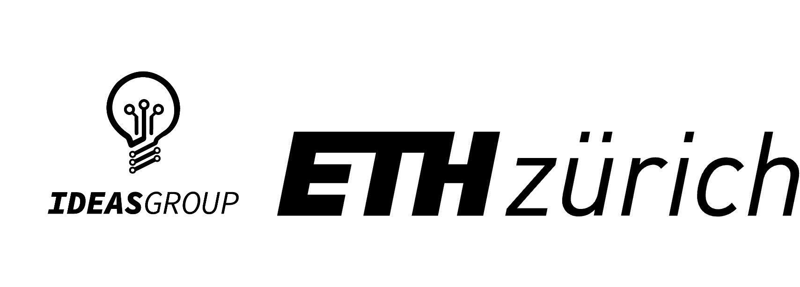

<!-- 
<p align="center">
  

# RFIC-TL: End-to-End Transfer Learning Framework for RFIC Passives

### Transfer Learning Framework -->
<table>
  <tr>
    <td style="vertical-align: middle;">
      
    </td>
    <td style="vertical-align: middle;">
      <h1 style="margin:0;">RFIC-TL: End-to-End Transfer Learning Framework for RFIC Passives</h1>
    </td>
  </tr>
</table>

**RFIC-TL** is an end-to-end learning framework designed to enable knowledge transfer for design migrations of mm-Wave passives in RF integrated circuits (RFICs). This framework can effectively accelerate design adaptation across different IC technologies, operating frequencies, and metal options by leveraging a pre-trained neural network model. It is demonstrated through a 1:1 on-chip transformer-based impedance matching network for case study.

## Authors & Citation
If you find this repository helpful, please cite our work.
- [IMS 2024] [Transfer Learning Assisted Fast Design Migration Over Technology Nodes: A Study on Transformer Matching Network](https://ieeexplore.ieee.org/document/10600344)
```
@INPROCEEDINGS{10600344,
  author={Chu, Chenhao and Mao, Yuhao and Wang, Hua},
  booktitle={2024 IEEE/MTT-S International Microwave Symposium - IMS 2024}, 
  title={Transfer Learning Assisted Fast Design Migration Over Technology Nodes: A Study on Transformer Matching Network}, 
  year={2024},
  volume={},
  number={},
  pages={188-191},
  keywords={Training;Passive networks;Adaptation models;Transfer learning;Metals;Artificial neural networks;Transformers;Deep learning;design technologies;direction synthesis;impedance matching;mm-Wave;source domain;target domain;training data;transfer learning;transformer},
  doi={10.1109/IMS40175.2024.10600344}}
```

**Data generation** is the ***fuel*** for the training deep learning neural networks. The advancements in the IC ***specs-to-layout*** challenge still heavily depend on EM simulators for accurate training data, which inevitably leads to high computational costs.This framework demonstrates the reduction of data generation necessary by leveraging transfer learning.

The open-sourced code for the transfer learning framework can be applied to processes including but not limited to:
- Silicon technologies
- III-V compound semiconductors
- PCB-based manufacturing processes

## Environment Setup

Install Anaconda or Miniconda before you continue. These are tools for managing Python environments. Check whether they are available by running ```conda --version```.

After installing, run the following in the terminal. For installation of PyTorch, make sure to check its official website to install the right version based on your GPU model.
```bash
# (optional but recommended) install libmambda solver for conda to speed up environment solving
conda update -n base conda
conda install -n base conda-libmamba-solver
conda config --set solver libmamba

# set up Python
conda create -n chip python=3.7
conda activate chip
# install PyTorch 1.13.1; take suitable GPU version by yourself
conda install pytorch==1.13.1 torchvision==0.14.1 torchaudio==0.13.1 pytorch-cuda=11.6 -c pytorch -c nvidia

# set up git
git clone https://github.com/ChenhaoChu/RFIC-TL.git -b main
cd RFIC-TL
pip install -r requirements.txt
pip uninstall neptune
```

## Data Availability
The training data is proprietary since it is trained on the process design kit of the chip foundry (which is proprietary). However, the code is open-sourced and can be used with any other dataset.

## Preprocess

The following command loads data stored in csv format and convert into npy. It separates X, Y and Z.
```bash
python preprocess.py
```
This will load the csv data file from ```./data``` and prepare the train, validation and test set for all source and target grids inside ```./data/{process}_{frequency}_{data density}```.

## Train from Scratch

The template is
```
python train.py --netname {netname} --data_type {subdir in ./data/} --tau 0.5 
```

For example, to train the source model with complete data, run
```
python train.py --netname Cascade_512 --data_type NodeA_MetalOptionA_FreqA_1 --tau 0.5 
```

## Knowledge Transfer to Target Grid

```
Technologies: NodeA and NodeB; Metal Options: MetalOptionA and MetalOptionB; Frequencies: FreqA and FreqB
```


The template is
```
python NodeAtoNodeB.py --netname {netname} --data_type {subdir in ./data/} --load-model {source model} --tau 0.5 --save_root {save root}
```

For example, to train NodeB MetalOptionA FreqA with 1% sparsity based on the source model trained from NodeA MetalOptionA FreqA with 100% data, run the following:
```
python NodeAtoNodeB.py --netname Cascade_512 --data_type NodeB_MetalOptionA_FreqA_0.01 --load-model models/scratch/NodeA_MetalOptionA_FreqA_1/Cascade_512/Epoch_300/tau_0.5/model.pt --tau 0.5 --save_root models/transfer/source_1
```

We also provide a bash script to for batch experiments in ```./scripts/train_parallel```.

## Neptune setup

If you would like to enable neptune logging, install neptune and follow the instructions on [neptune documentation](https://docs.neptune.ai/setup/setting_api_token/).

License and Copyright
---------------------

* Copyright (c) 2025 Chenhao Chu, Yuhao Mao, Hua Wang
* Licensed under the [Apache License](https://www.apache.org/licenses/LICENSE-2.0)
